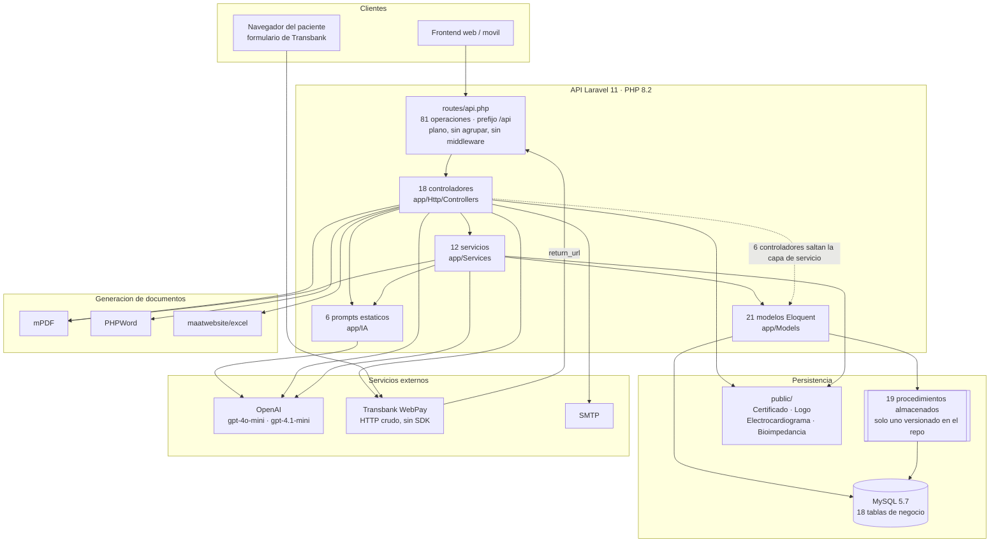
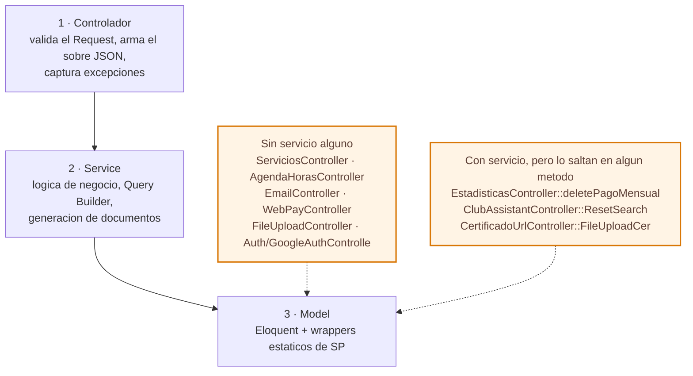
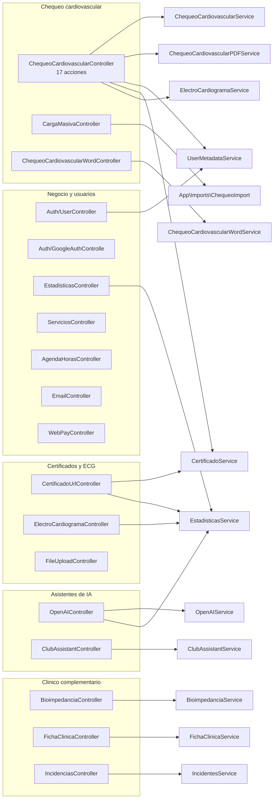
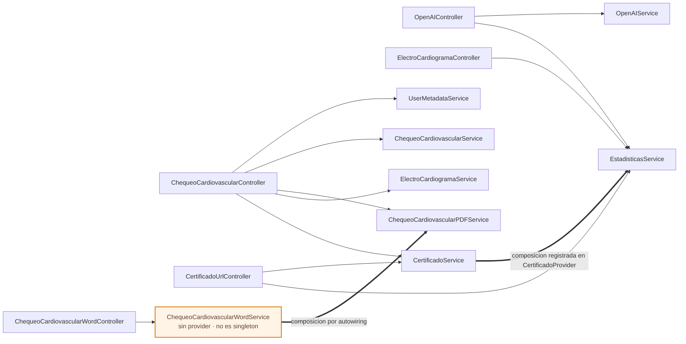
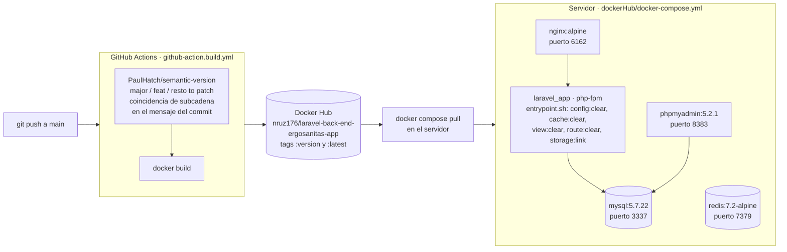
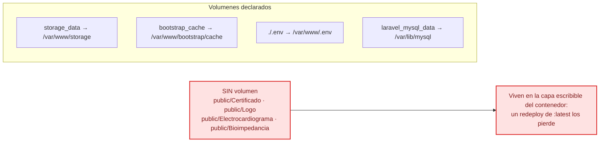

# Arquitectura y componentes

Vista de conjunto del backend de Ergosanitas: qué piezas hay, cómo se llaman entre ellas y cómo se despliega. Para el detalle en prosa, el [README](../README.md); para el contrato de cada endpoint, [`openapi.yaml`](openapi.yaml).

- [Vista de componentes](#vista-de-componentes)
- [Las tres capas y sus excepciones](#las-tres-capas-y-sus-excepciones)
- [Mapa de dominios](#mapa-de-dominios)
- [Inyección de dependencias](#inyección-de-dependencias)
- [Despliegue](#despliegue)

---

## Vista de componentes

API REST en Laravel 11 sin frontend propio. Todo se expone bajo `/api`, desde un único archivo de rutas plano y **sin middleware de autenticación en ninguna ruta de negocio**.

Dos cosas que el diagrama deja ver y conviene no olvidar:

- **`user_email` y `perfiles_id` llegan como datos del request**, no como identidad verificada. El filtrado por perfil es una regla de presentación, no un control de acceso.
- **Los archivos subidos van a `public/` con `$file->move()`**, no al disco de storage de Laravel, y `public/` no está montado como volumen en producción (ver [Despliegue](#despliegue)).

---

## Las tres capas y sus excepciones

El patrón declarado es Controller → Service → Model. Se cumple en la mayoría de los dominios, pero **seis controladores no inyectan ningún servicio** y hablan directo con modelos o facades.

`bootstrap/app.php` no registra middleware ni manejador de excepciones (ambos closures están vacíos) y **no existe `app/Http/Middleware`**. Por eso cada acción envuelve su cuerpo en `try/catch` y arma el sobre a mano: no hay handler global que lo haga.

> **Conviven siete formatos de respuesta**, no uno. Al tocar un endpoint hay que respetar el que ya devuelve: cambiarlo rompe a los clientes. Ver la tabla completa en el [README](../README.md#formatos-de-respuesta).

---

## Mapa de dominios

Qué controlador atiende cada dominio y con qué servicio trabaja.

`ServiciosController`, `AgendaHorasController`, `EmailController`, `GoogleAuthControlle`, `FileUploadController` y `WebPayController` no aparecen conectados a ningún servicio porque no tienen ninguno: van directo al modelo.

> `CargaMasivaController` **sí inyecta** `ChequeoCardiovascularService` en su constructor, pero nunca lo usa: la carga masiva pasa por `App\Imports\ChequeoImport`. El diagrama muestra la llamada real, no la dependencia declarada.

---

## Inyección de dependencias

Todos los servicios se registran **a mano** en `bootstrap/providers.php` — no hay auto-discovery. Cada provider es un `singleton()` con una closure trivial; el único que resuelve una dependencia es `CertificadoProvider`.

Los 12 providers registrados en `bootstrap/providers.php`:

| Provider | Registra |
|---|---|
| `AppServiceProvider` | nada (`register` y `boot` vacíos) |
| `BioimpedanciaServiceProvider` | `BioimpedanciaService` |
| `CertificadoProvider` | `CertificadoService`, **inyectándole `EstadisticasService`** |
| `ChequeoCardiovascularPDFProvider` | `ChequeoCardiovascularPDFService` |
| `ChequeoCardiovascularProvider` | `ChequeoCardiovascularService` |
| `ClubAssistantServiceProvider` | `ClubAssistantService` |
| `ElectroCardiogramaProvider` | `ElectroCardiogramaService` |
| `EstadisticasProvider` | `EstadisticasService` |
| `FichaClinicaServiceProvider` | `FichaClinicaService` |
| `IncidenciaServiceProvider` | `IncidentesService` |
| `OpenAIServiceProvider` | `OpenAIService` |
| `UserMetadataProvider` | `UserMetadataService` |

> ⚠️ **`ChequeoCardiovascularWordService` no tiene provider.** Laravel lo resuelve igual por autowiring —su constructor solo pide otro servicio—, pero **deja de ser singleton**: se construye una instancia nueva en cada request. Es la excepción real a la regla «cada servicio necesita su propio ServiceProvider».

Al crear un servicio nuevo hay que hacer las tres cosas: `app/Services/XService.php`, `app/Providers/XServiceProvider.php` con un `singleton()`, y la línea en `bootstrap/providers.php`. Los nombres de provider son inconsistentes (`CertificadoProvider` vs `BioimpedanciaServiceProvider`); sigue el existente del dominio que toques.

---

## Despliegue

Push a `main` publica directo: **no hay lint, ni tests, ni migraciones en el pipeline**.

Dos consecuencias del diagrama:

- **El bump de versión lo decide el texto del mensaje de commit.** Son coincidencias de subcadena, así que un mensaje como *«refactor: quita el feature flag»* sube minor sin querer.
- **`entrypoint.sh` hace `config:clear` en cada arranque a propósito.** Varios controladores y servicios leen `env()` fuera de `config/` (`API_PATH_CER`, `API_PATH_LOGO`, `WEBPAY_*`, `GOOGLE_CLIENT_*`); con la config cacheada esas llamadas devuelven `null` y se rompen certificados, logos, pagos y login de Google. **Nunca ejecutes `php artisan config:cache`.**

### Volúmenes

Tenlo presente antes de proponer que algo nuevo se guarde en `public/`.

---

**Siguiente:** [Flujos end-to-end](flujos.md) · [Diagrama de clases](diagrama-clases.md) · [Modelo de datos](modelo-datos.md)
