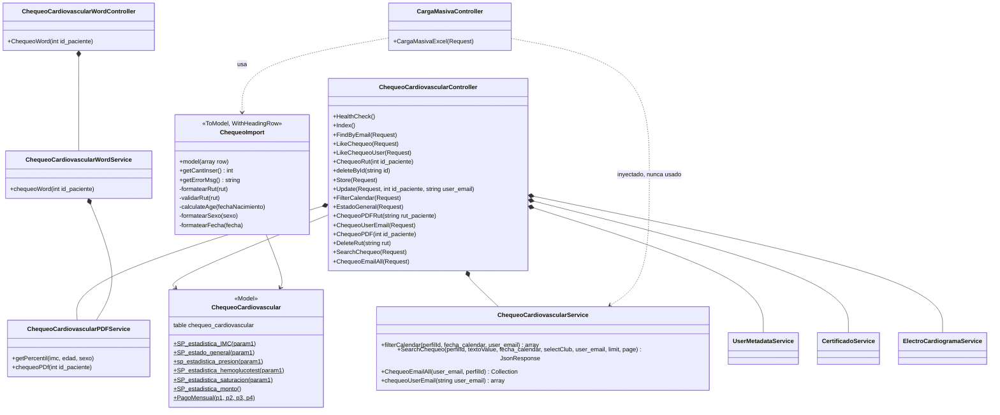
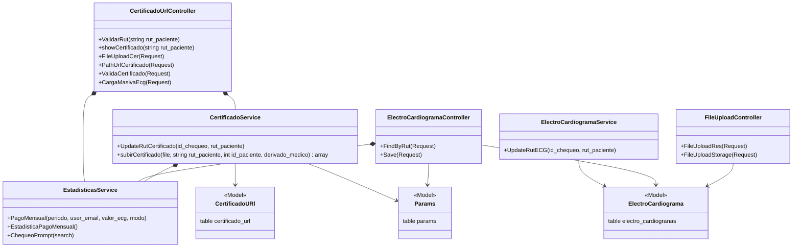
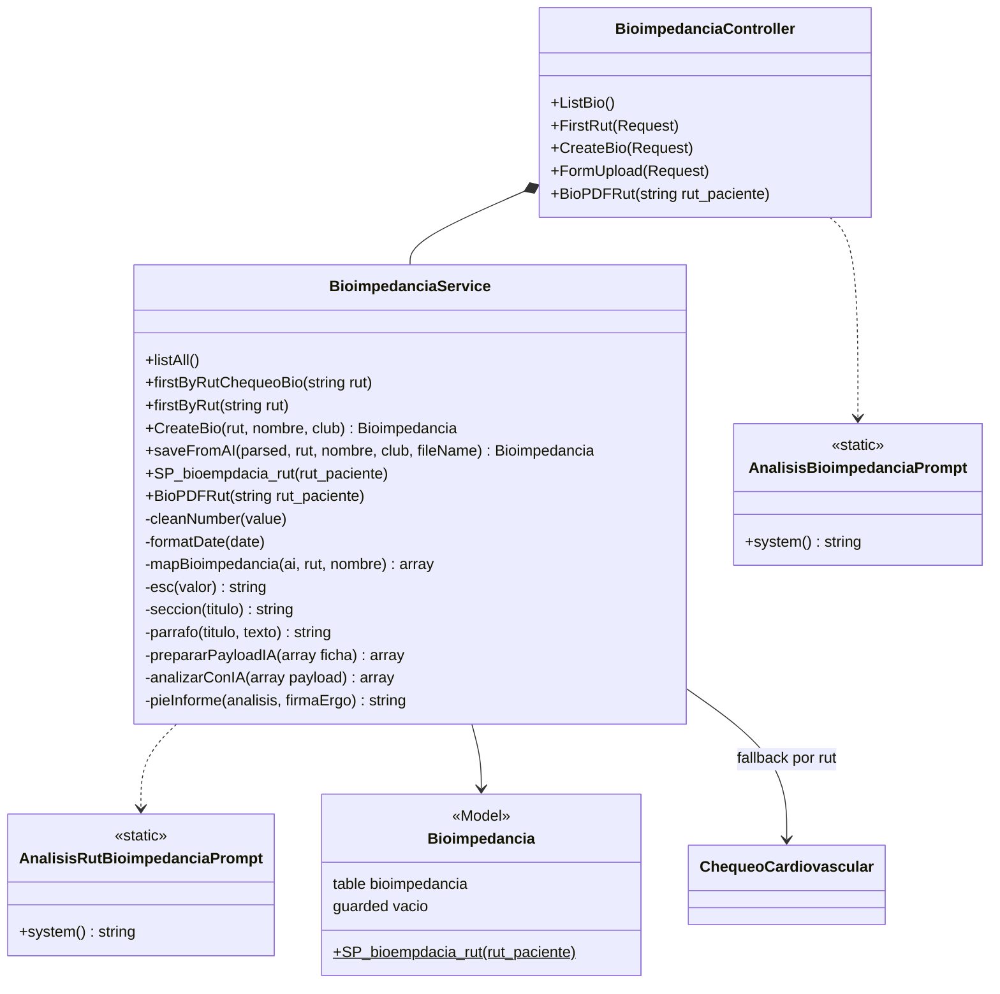
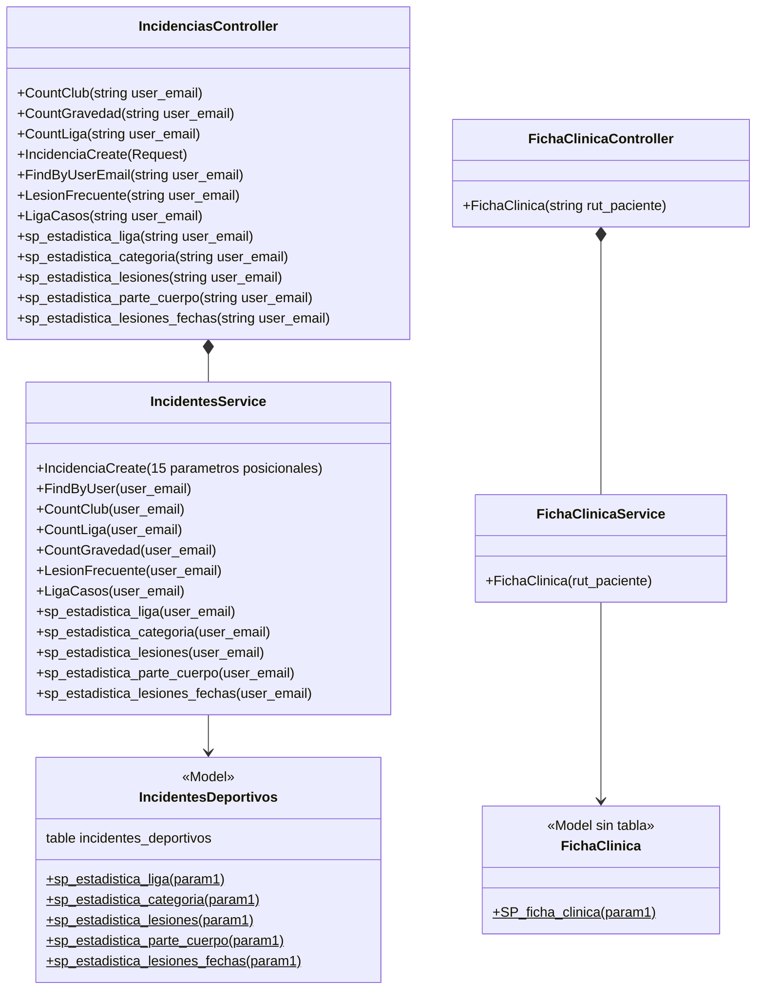
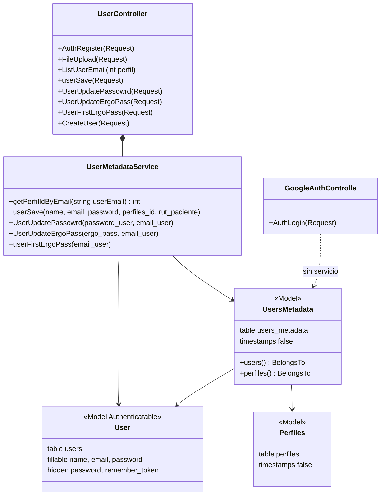
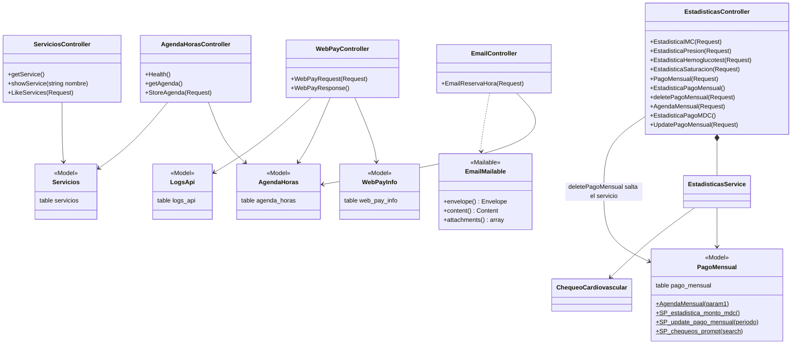
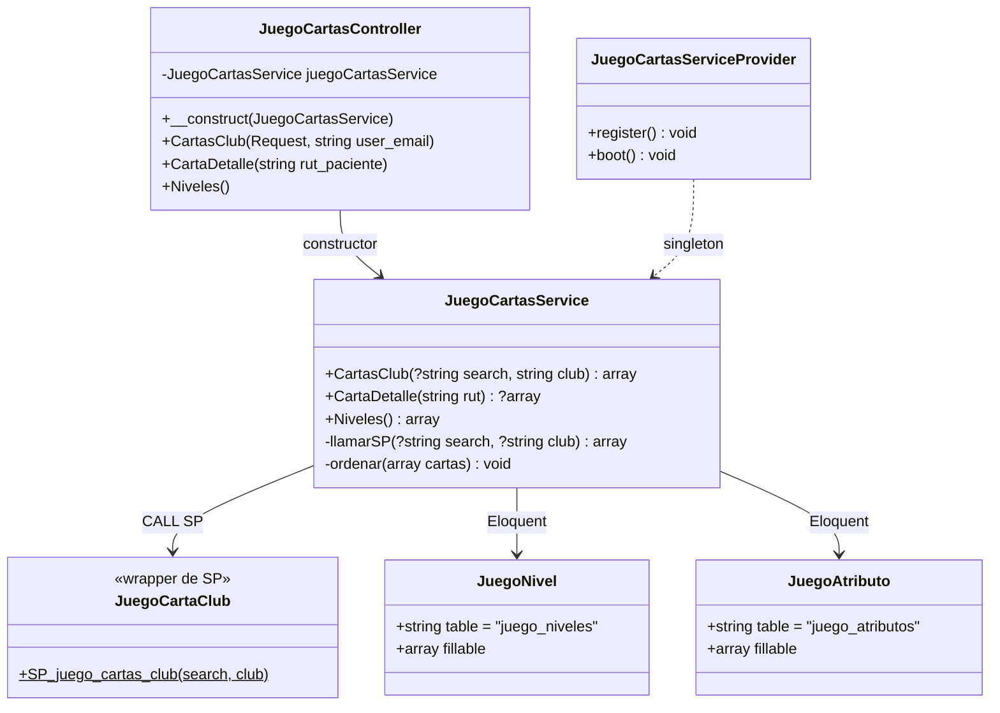

# Diagrama de clases

Clases reales del proyecto por dominio, con sus firmas tal como están en el código —typos consolidados incluidos—. Cada diagrama se mantiene por debajo de ~20 clases para que siga siendo legible.

- [Chequeo cardiovascular](#chequeo-cardiovascular)
- [Certificados y electrocardiogramas](#certificados-y-electrocardiogramas)
- [Asistentes de IA](#asistentes-de-ia)
- [Bioimpedancia](#bioimpedancia)
- [Incidencias y ficha clínica](#incidencias-y-ficha-clínica)
- [Usuarios y perfiles](#usuarios-y-perfiles)
- [Agenda, servicios y pagos](#agenda-servicios-y-pagos)
- [Convenciones y anomalías](#convenciones-y-anomalías)

---

## Chequeo cardiovascular

El dominio central. `ChequeoCardiovascularController` es el que más servicios compone: cinco.

`ChequeoCardiovascularService` **no tiene constructor**: trabaja con el Query Builder directamente (`DB::table('chequeo_cardiovascular as cc')`) e importa `ChequeoCardiovascular` sin usarlo.

> `DeleteRut()` es un método público **sin ruta**: la línea `DELETE chequeo-cardiovascular/{rut}` está comentada en `routes/api.php`.

---

## Certificados y electrocardiogramas

La única composición servicio→servicio registrada en un provider vive aquí: `CertificadoService` recibe `EstadisticasService`, y por eso subir un certificado factura.

> ⚠️ `CertificadoUrlController::FileUploadCer()` **no llama a `CertificadoService::subirCertificado()`**: reimplementa a mano los mismos siete pasos (borrar, mover, insertar, marcar `ECG FOTO`, leer `VALOR-ECG`, facturar). Al cambiar la regla hay que tocar los dos sitios.
>
> `FileUploadController::FileUploadStorage()` es otro método público **sin ruta**.

---

## Asistentes de IA

Los prompts son clases estáticas sin estado en `app/IA/`: no se inyectan y no tienen constructor, solo producen strings o arrays de mensajes.

```mermaid
classDiagram
    class OpenAIController {
        +resetPatient(Request)
        +AsQuestionUseCase(Request, OpenAIService)
        +AsistenteVoz(Request)
        +AnalisisEcg(Request)
    }

    class ClubAssistantController {
        +AsQuestionClubUseCase(Request)
        +ResetSearch(Request)
    }

    class OpenAIService {
        +resolveSession(string sessionId, string prompt) ChatSessions
        +handle(ChatSessions session, string prompt) array
    }

    class ClubAssistantService {
        +MAX_PACIENTES = 120
        +resolveSession(sessionId, clubEmail, search) ChatClubSessions
        +datosClub(search, clubEmail) array
        +handle(ChatClubSessions session, string prompt) array
        +guardarRespuesta(session, texto, data) void
        -normalizarPresion(array paciente) array
    }

    class PatientHelper {
        <<static>>
        +extractPatient(string prompt) string
        -promptSistema() string
    }

    class AsistenteChatPacientePrompt {
        <<static>>
        +system(string patient, array data) array
    }

    class AsistenteChatClubPrompt {
        <<static>>
        +system(club, search, pacientes, total, truncado) array
    }

    class AnalisisECGPrompt {
        <<static>>
        +system() string
    }

    class AsistenteVozPrompt {
        <<static>>
        +system() string
    }

    class ChatSessions {
        <<Model>>
        table chat_sessions
        session_id, patient_identifier
    }
    class ChatHistory {
        <<Model>>
        table chat_history
        patient_identifier, role, message, context_json
    }
    class ChatClubSessions {
        <<Model>>
        table chat_club_sessions
        session_id, club_email, search_actual
    }
    class ChatClubHistory {
        <<Model>>
        table chat_club_history
        session_id, club_email, role, message, context_json
    }
    class ChequeoClubPrompt {
        <<Model sin tabla>>
        +SP_chequeos_club_prompt(search, club)$
    }

    OpenAIController *-- OpenAIService
    OpenAIController *-- EstadisticasService
    OpenAIController ..> AsistenteChatPacientePrompt
    OpenAIController ..> AnalisisECGPrompt
    OpenAIController ..> AsistenteVozPrompt
    OpenAIService ..> PatientHelper
    OpenAIService --> ChatSessions
    OpenAIService --> ChatHistory
    ClubAssistantController *-- ClubAssistantService
    ClubAssistantController ..> AsistenteChatClubPrompt
    ClubAssistantService --> ChatClubSessions
    ClubAssistantService --> ChatClubHistory
    ClubAssistantService --> ChequeoClubPrompt
```

### Qué modelo de OpenAI usa cada prompt

| Prompt | Modelo | Dónde se invoca |
|---|---|---|
| `PatientHelper` (extracción de paciente) | `gpt-4o-mini`, `temperature: 0` | `OpenAIService::resolveSession()` |
| `AsistenteChatPacientePrompt` | `gpt-4o-mini`, `temperature: 0.2` | `OpenAIController::AsQuestionUseCase()` |
| `AsistenteChatClubPrompt` | `gpt-4o-mini`, `temperature: 0.2` | `ClubAssistantController::AsQuestionClubUseCase()` |
| `AnalisisECGPrompt` | `gpt-4.1-mini` (visión, 2000 tokens) | `OpenAIController::AnalisisEcg()` |
| `AsistenteVozPrompt` | `gpt-4.1-mini`, `temperature: 0.1` | `OpenAIController::AsistenteVoz()` |
| `AnalisisBioimpedanciaPrompt` | `gpt-4.1-mini` (visión) | `BioimpedanciaController::FormUpload()` |
| `AnalisisRutBioimpedanciaPrompt` | `gpt-4.1-mini` | `BioimpedanciaService::analizarConIA()` |

**Dónde ocurre cada llamada es inconsistente** —el chat clínico pasa por el servicio, el ECG y la voz llaman a `OpenAI::chat()` directo en el controlador, y bioimpedancia lo hace en ambos sitios—. Sigue el patrón del dominio que toques.

> ⚠️ Cada prompt debe vivir en **un solo archivo**. Dos archivos que declaren la misma clase en `app/IA/` colisionan en el classmap que genera `composer install --optimize-autoloader` (lo que hace el `dockerfile` de producción) y cuál gana queda indeterminado. Para versionar un prompt, usa git, no copias del archivo.
>
> ⚠️ `OpenAIController::AsQuestionUseCase()` recibe `OpenAIService` **dos veces**: por constructor y como parámetro del método. Usa el del método, así que la propiedad del constructor queda muerta.

---

## Bioimpedancia

`BioimpedanciaService` es el archivo más grande del proyecto (~980 líneas) y concentra extracción con IA, mapeo, consulta al procedimiento almacenado y generación del informe.

`Bioimpedancia` es el único modelo con `$guarded = []`; el resto no declara `$fillable` salvo los cuatro modelos de chat.

---

## Incidencias y ficha clínica

Dos dominios de solo lectura estadística, casi enteramente delegados a procedimientos almacenados.

`IncidentesService` filtra siempre por `club_deportivo`; la tabla `incidentes_deportivos` **no guarda RUT**, así que se relaciona con el resto del sistema solo por `user_email`.

> `IncidenciasController` es el único que devuelve **HTTP 201 también en las lecturas** (`GET`).

---

## Usuarios y perfiles

`UsersMetadata` es el **único modelo con relaciones Eloquent declaradas** en todo el proyecto. `getPerfilIdByEmail()` es la fuente del `perfilId` que alimenta todo el filtrado por perfil.

> Los typos `GoogleAuthControlle` (sin la «r» final, tanto el archivo como la clase) y `UserUpdatePassowrd` están consolidados: no los «corrijas» sin actualizar `routes/api.php` y los clientes.

---

## Agenda, servicios y pagos

Cuatro controladores sin ninguna capa de servicio: van directo al modelo.

`LogsApi` solo lo escribe `WebPayController`: es el único dominio del proyecto que persiste errores.

---

## Juego de cartas

Vertical slice completo y reciente: es el ejemplo más limpio del patrón Controller → Service → Model del repo, porque se escribió con las convenciones ya documentadas.

Detalles que no se ven en el diagrama:

- `JuegoCartaClub` **no declara `$table`**: solo envuelve el procedimiento, igual que `FichaClinica`. `JuegoNivel` y `JuegoAtributo` sí son modelos Eloquent reales.
- `llamarSP()` usa la variante **defensiva** de `json_decode` (la de `ClubAssistantService`, no la de `FichaClinicaService`): comprueba `empty($results[0]->resultado_json)` y valida `is_array()` antes de seguir.
- `ordenar()` existe porque **en MySQL 5.7 `JSON_ARRAYAGG` no respeta `ORDER BY`**. Ordena por `puntaje` descendente, desempata por `atributos_medidos` descendente —para que una carta con los cuatro atributos gane a otra que empata con solo dos— y manda las `sin_evaluar` al final.
- `JuegoCartasServiceProvider` está registrado en `bootstrap/providers.php`, en orden alfabético entre `IncidenciaServiceProvider` y `OpenAIServiceProvider`.

---

## Convenciones y anomalías

**Convenciones propias del repo** (respétalas al añadir código):

- Los métodos de controlador van en `PascalCase` (`FindByEmail`, `ChequeoPDFRut`), a diferencia de la convención Laravel por defecto. Hay excepciones ya existentes en minúscula: `resetPatient`, `deleteById`, `deletePagoMensual`, `chequeoUserEmail`.
- Los modelos exponen **wrappers estáticos** sobre `DB::select('CALL SP_xxx(?)')` en vez de repartir los `CALL` por los servicios.
- Los prompts viven en `app/IA/` como clases estáticas, nunca incrustados en controladores.

**Anomalías estructurales visibles en los diagramas:**

| Anomalía | Dónde |
|---|---|
| Servicio inyectado y nunca usado | `CargaMasivaController` → `ChequeoCardiovascularService` |
| Servicio inyectado dos veces | `OpenAIController::AsQuestionUseCase` → `OpenAIService` |
| Servicio sin provider (no es singleton) | `ChequeoCardiovascularWordService` |
| Lógica de servicio duplicada en el controlador | `CertificadoUrlController::FileUploadCer` |
| Métodos públicos sin ruta | `ChequeoCardiovascularController::DeleteRut`, `FileUploadController::FileUploadStorage` |
| Modelos sin tabla (envoltorios de SP) | `FichaClinica`, `ChequeoClubPrompt` |

---

**Ver también:** [Arquitectura](arquitectura.md) · [Flujos end-to-end](flujos.md) · [Modelo de datos](modelo-datos.md)
