# Flujos end-to-end

Un diagrama de secuencia por flujo de negocio, con el endpoint que lo dispara y las advertencias que no se ven leyendo un solo archivo. Todo está contrastado contra el código, no contra la documentación en prosa.

| # | Flujo | Endpoint principal |
|---|---|---|
| 1 | [Login y perfiles](#1-login-y-perfiles) | `POST auth-register` · `POST auth-login` |
| 2 | [Carga masiva desde Excel](#2-carga-masiva-desde-excel) | `POST carga-masiva/excel` |
| 3 | [Ciclo de vida del chequeo](#3-ciclo-de-vida-del-chequeo) | `POST` / `PUT chequeo-cardiovascular` |
| 4 | [Certificado y facturación](#4-certificado-y-facturación) | `POST certificado/save-url` |
| 5 | [ECG del cardiólogo](#5-ecg-del-cardiólogo) | `POST electro-cardiograma/save` |
| 6 | [Generación de documentos](#6-generación-de-documentos) | `GET chequeo-cardiovascular/pdf/{id}` |
| 7 | [Bioimpedancia con IA](#7-bioimpedancia-con-ia) | `POST bioimpedancia/form-upload` |
| 8 | [Informe de bioimpedancia](#8-informe-de-bioimpedancia) | `GET bioimpedancia/pdfRut/{rut}` |
| 9 | [Asistente clínico SAM](#9-asistente-clínico-sam) | `POST sam-assistant/as-question` |
| 10 | [Asistente por club](#10-asistente-por-club) | `POST sam-assistant-club/as-question` |
| 11 | [Pago WebPay](#11-pago-webpay) | `POST transbank/web-pay-request` |
| 12 | [Agenda, correo y estadísticas](#12-agenda-correo-y-estadísticas) | `POST agenda-horas` · `POST email/reserva-hora` |

---

## 1. Login y perfiles

Coexisten tres mecanismos de autenticación (sesión con `Auth::attempt`, Sanctum solo en `/user`, y JWT configurado como guard `api`), pero **ninguna ruta de negocio lleva middleware**. El login sirve para obtener el perfil, no para proteger endpoints.

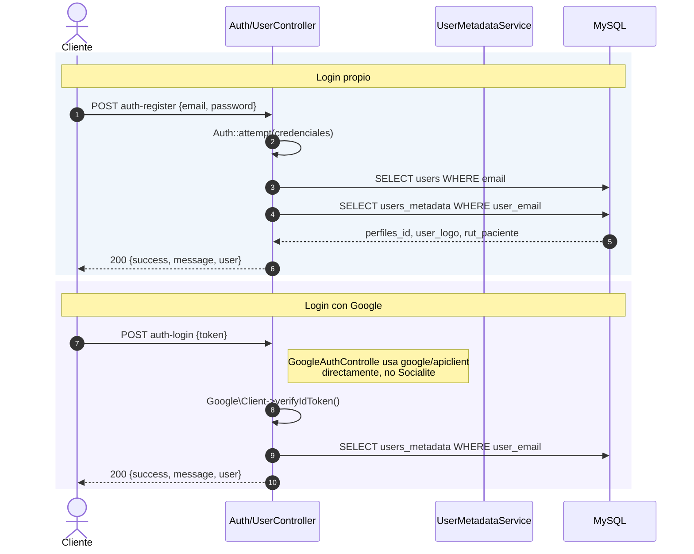

Los usuarios viven en **dos tablas** que hay que mantener sincronizadas: `users` (password hasheada por Laravel) y `users_metadata` (perfil, logo, RUT, `ergo_pass` y **una copia en claro de la contraseña**). `UserMetadataService::userSave()` y `UserUpdatePassowrd()` escriben en ambas.

> `GOOGLE_CLIENT_ID` y `GOOGLE_CLIENT_SECRET` se leen con `env()` dentro del propio controlador: si alguien ejecuta `config:cache`, el login de Google deja de funcionar.

---

## 2. Carga masiva desde Excel

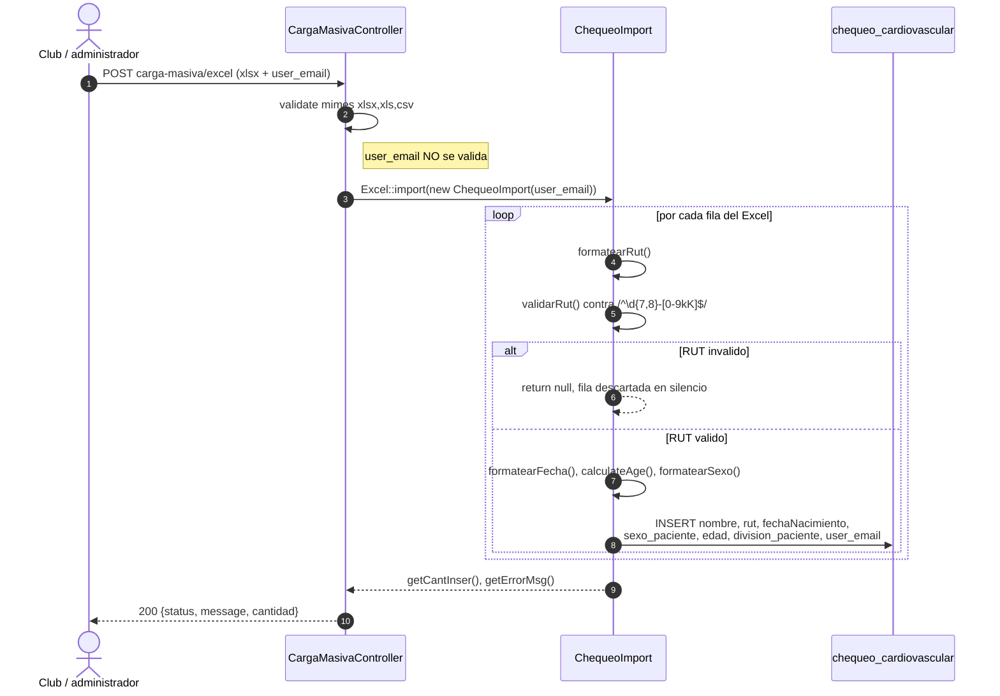

Columnas esperadas del Excel (fila de cabecera, en snake_case): `rut`, `nombre_completo`, `fecha_nacimiento`, `sexo`, `division`.

**Advertencias:**

- Las filas con RUT inválido se **descartan en silencio**: no incrementan el contador ni el mensaje de error. El `message` de la respuesta es `'OK'` mientras no haya habido una excepción, aunque se hayan perdido N filas.
- El dígito verificador **no se valida**, solo el formato.
- `formatearSexo()` cae en `"Masculino"` ante cualquier valor que no sea `M` o `F`.
- El importador **no escribe `status`**: queda el default de la base (`ingresado`).
- `CargaMasivaController` inyecta `ChequeoCardiovascularService` en su constructor y **nunca lo usa**.

---

## 3. Ciclo de vida del chequeo

El `perfiles_id` se obtiene siempre con `UserMetadataService::getPerfilIdByEmail()` y decide qué se escribe y qué se ve.

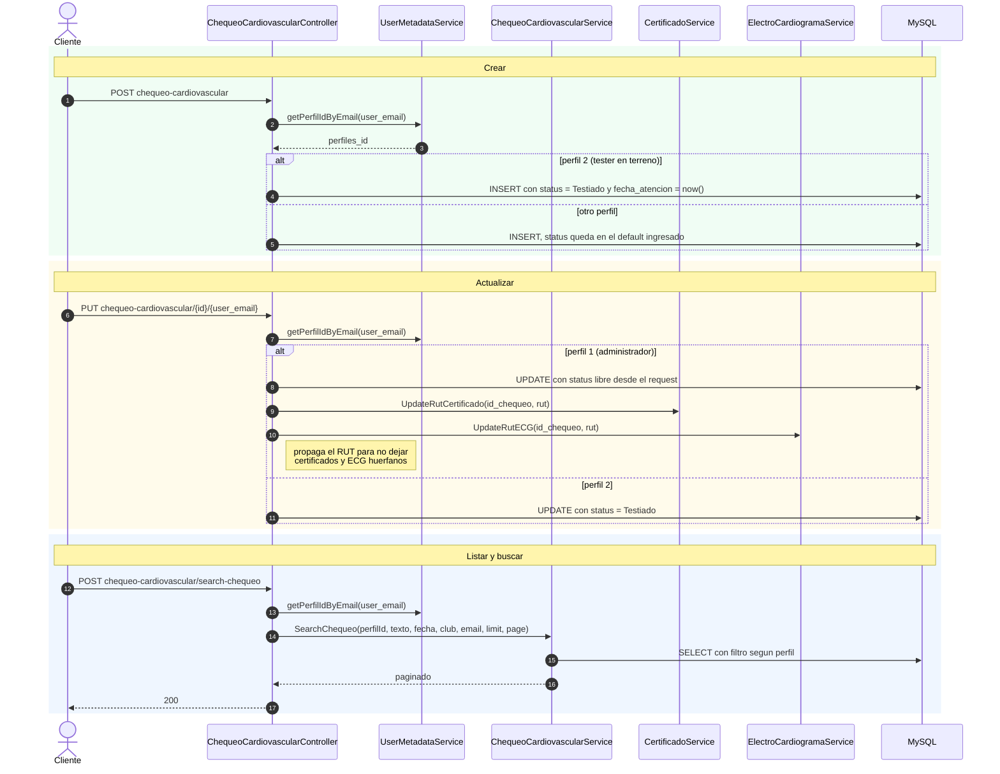

El filtrado por perfil (3 = club, 6 = médico, resto = todo) está detallado en [modelo-datos.md](modelo-datos.md#autorización-por-perfil), y la máquina de estados en [la misma página](modelo-datos.md#máquina-de-estados-del-chequeo).

---

## 4. Certificado y facturación

**Es el efecto cruzado más fácil de pasar por alto del proyecto**: subir un documento no solo guarda un archivo, también cambia el estado del chequeo y **factura el mes del club**.

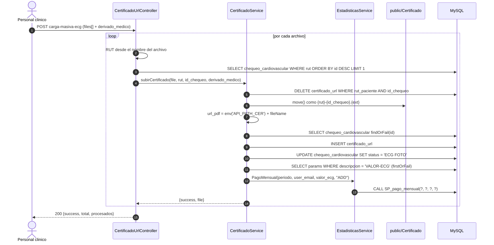

**Cuatro advertencias que el diagrama hace visibles:**

1. **No hay idempotencia: cada subida vuelve a facturar.** Reintentar una carga fallida, o corregir un documento, suma otro cargo al mes del club. `carga-masiva-ecg` factura **una vez por archivo**: un lote de 200 PDF genera 200 cargos.
2. **No hay transacción.** Si falta la fila `VALOR-ECG` en `params`, el `firstOrFail()` lanza un 500 **después** de haber movido el archivo, insertado el certificado y cambiado el `status`. El chequeo queda en un estado inconsistente.
3. **`CertificadoUrlController::FileUploadCer` duplica a mano** toda esta lógica en vez de llamar a `CertificadoService::subirCertificado()`. Si cambias la regla de facturación hay que tocar los dos sitios.
4. `url_pdf` se arma con `env('API_PATH_CER')`: otra razón por la que `config:cache` rompe producción.

El reverso manual es `POST estadisticas/delete-pago-mensual`, que hace un `DELETE` físico sobre `pago_mensual` por `(club, periodo)`, sin confirmación y sin control de acceso.

---

## 5. ECG del cardiólogo

Segundo camino de facturación, con la misma estructura pero distinto estado final.

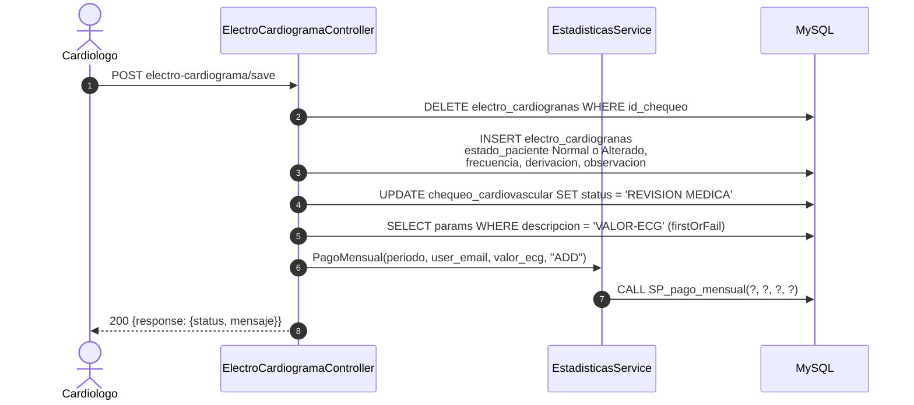

> ⚠️ Un chequeo que pasa **primero por certificado y luego por ECG factura dos veces**: son dos llamadas independientes a `SP_pago_mensual(..., "ADD")` y ninguna comprueba si ya existe el cargo.

Consultar el ECG (`POST electro-cardiograma/find-by-rut`) tiene su propia trampa: el `catch` devuelve **HTTP 200 con datos vacíos**, así que un error de base se ve igual que un paciente sin ECG.

---

## 6. Generación de documentos

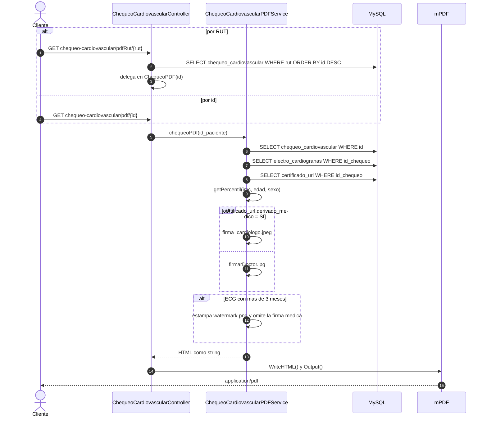

- Los assets (`logo.png`, `firmarDoctor.jpg`, `firmarErgo.jpg`, `watermark.png`, `firma_cardiologo.jpeg`) se referencian con `public_path()`.
- Si `chequeo_cardiovascular.fileName` está lleno, el PDF embebe `public/Electrocardiograma/{fileName}` como imagen final.
- La presión se imprime como `presion_sistolica/presionArterial` — en esta tabla **`presionArterial` guarda la diastólica**.
- La variante Word (`GET chequeo-cardiovascular-word/{id}`) usa `ChequeoCardiovascularWordService` con PHPWord y **reutiliza `getPercentil()`** del servicio de PDF.

---

## 7. Bioimpedancia con IA

Extracción de datos desde la foto o el PDF del informe de la balanza.

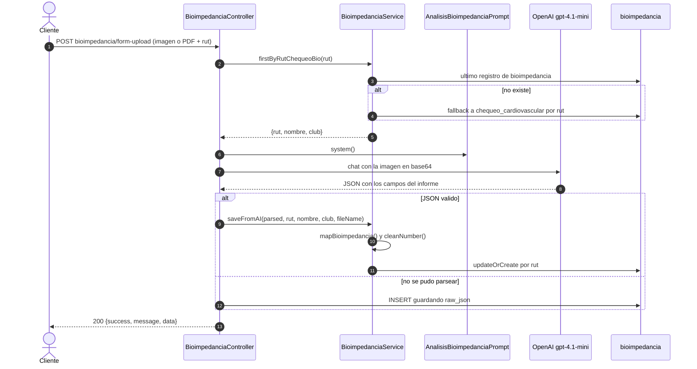

Las claves del JSON que produce el prompt son exactamente las columnas de la tabla `bioimpedancia`; `mapBioimpedancia()` es el punto donde se traduce.

---

## 8. Informe de bioimpedancia

El otro sentido: interpretar datos ya guardados y redactar el informe en PDF.

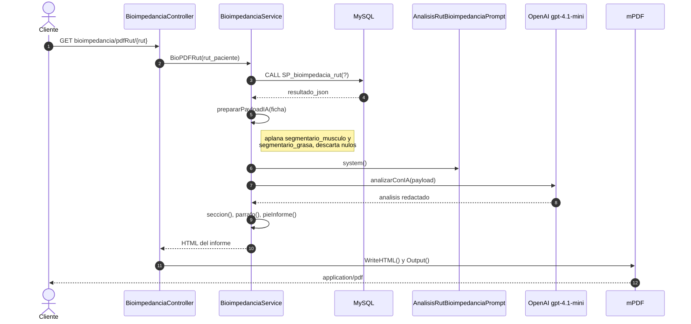

> El método del modelo se llama `SP_bioempdacia_rut()` y el procedimiento `SP_bioimpedacia_rut`. **Son dos typos distintos, ambos consolidados**: respétalos.

---

## 9. Asistente clínico SAM

Chat por paciente. La sesión guarda el paciente activo; el historial se guarda por paciente.

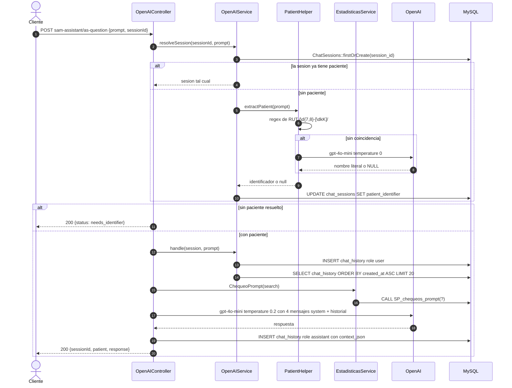

**Tres particularidades:**

- El paciente de la sesión es una **puerta de un solo sentido**: una vez fijado, `resolveSession()` ya no vuelve a intentar extraerlo. Para cambiarlo hay que llamar a `POST sam-assistant/reset-patient`, que limpia solo `patient_identifier` y conserva el historial.
- El historial se agrupa por `patient_identifier` y **no guarda `session_id`**: dos sesiones distintas que hablen del mismo paciente comparten la conversación.
- ⚠️ `handle()` usa `orderBy('created_at', 'asc')->limit(20)`, así que recupera los **20 mensajes más antiguos**, no los más recientes. A partir del mensaje 21 el contexto conversacional queda congelado en el inicio. El asistente por club no tiene este problema.

---

## 10. Asistente por club

Flujo paralelo al anterior, construido sin tocarlo. En vez de girar en torno a un paciente, responde sobre **el conjunto de pacientes en `REVISION MEDICA` de un club**.

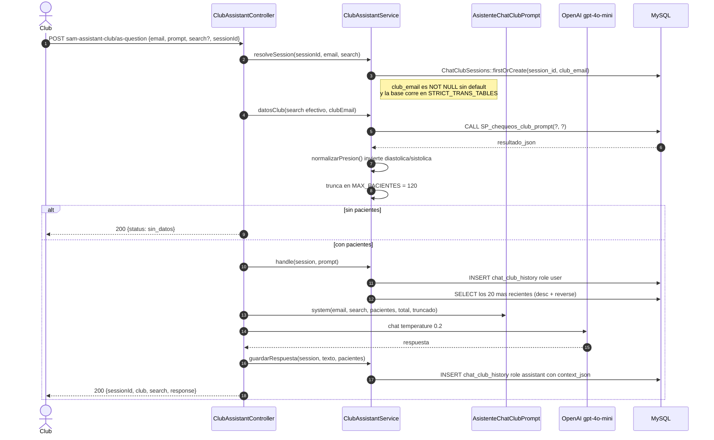

La semántica del campo `search` es el detalle importante para el cliente, porque **se persiste en la sesión**:

| Cómo se envía | Efecto |
|---|---|
| El campo no viene en el JSON | Se conserva el `search_actual` que ya tenía la sesión |
| `"search": ""` | Reset explícito: el chat pasa a hablar de todo el club |
| `"search": "Fuentes"` | Se guarda ese filtro y el chat queda acotado a ese paciente |

`POST sam-assistant-club/reset-search` equivale a enviar `"search": ""`.

Notas adicionales: el prompt recibe el total real y una marca de truncado para que el asistente avise cuando ve solo una parte; `SP_chequeos_club_prompt` filtra `status = 'REVISION MEDICA'`, así que **el chat de club no ve chequeos en otros estados**; y es el **único controlador que captura `ValidationException` por separado** y responde un 422 correcto.

---

## 11. Pago WebPay

Integración por HTTP crudo, **sin el SDK de Transbank**.

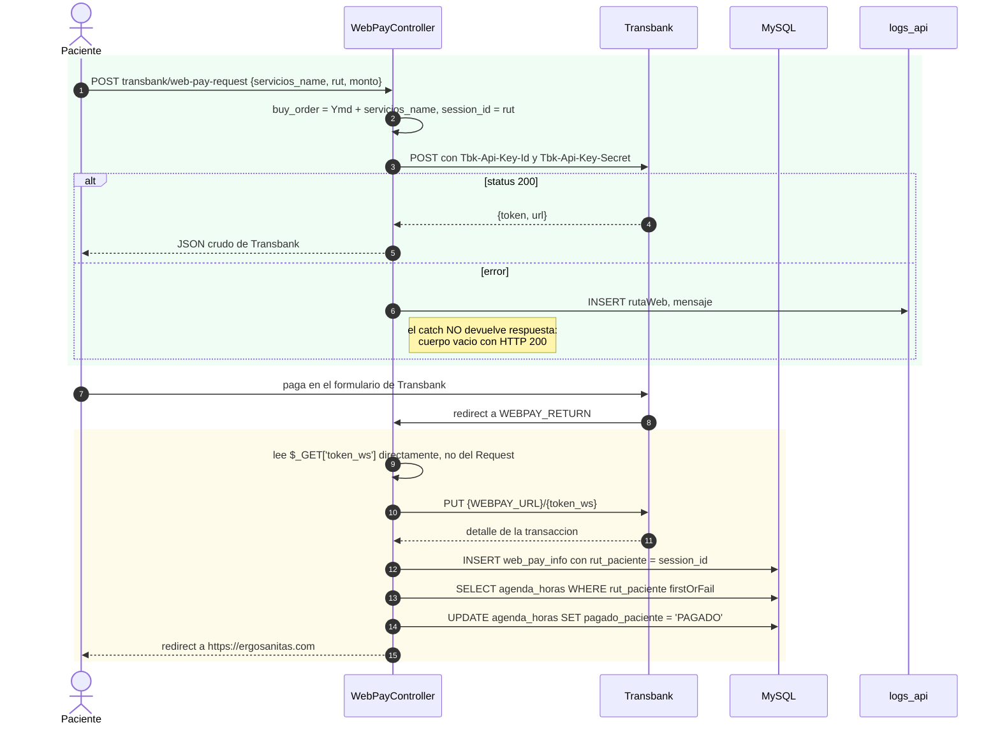

**Tres problemas conocidos de este controlador:**

1. Es el único lugar del código que persiste errores (`logs_api`), pero el `catch` **no devuelve respuesta**: un fallo de Transbank sale como cuerpo vacío.
2. **No se valida `response_code` ni `status`** de Transbank antes de marcar la reserva como `PAGADO`.
3. El `firstOrFail()` sobre `agenda_horas` toma la **primera** reserva del RUT, no la última: con dos reservas del mismo paciente marca la equivocada.

`WEBPAY_URL`, `WEBPAY_ID`, `WEBPAY_SECRET` y `WEBPAY_RETURN` se leen con `env()` dentro del controlador.

---

## 12. Agenda, correo y estadísticas

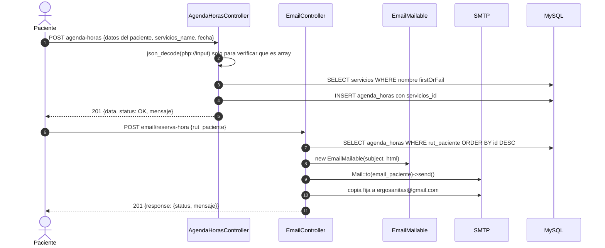

El envío es **síncrono, sin cola**: `EmailMailable` importa `ShouldQueue` pero no lo implementa. `GET agenda-horas` devuelve la lista completa, sin filtro por club ni paginación.

### Estadísticas

Casi todo el cálculo estadístico vive en MySQL, no en PHP. El patrón es siempre el mismo:

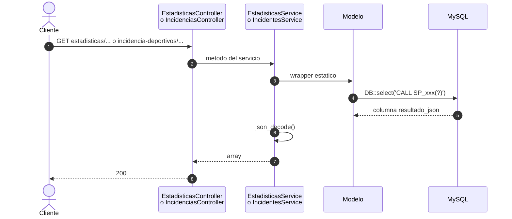

La lista completa de procedimientos y a qué endpoint corresponde cada uno está en [modelo-datos.md](modelo-datos.md#procedimientos-almacenados).

> Los 19 procedimientos que invoca la API están listados en [modelo-datos.md](modelo-datos.md#procedimientos-almacenados). La base declara 23: los cuatro restantes (`SP_cargar_desde_chequeo`, `SP_filtros_dashboard`, `SP_procesar_mes` y `tmp_call_sp`) no los llama ningún endpoint.

---

**Ver también:** [Arquitectura](arquitectura.md) · [Diagrama de clases](diagrama-clases.md) · [Modelo de datos](modelo-datos.md)
