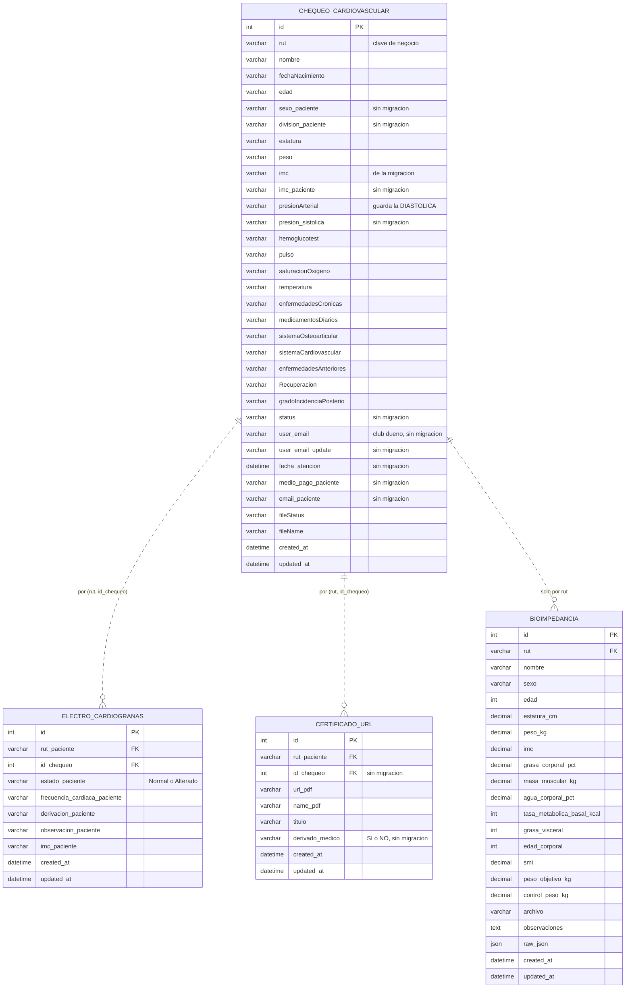
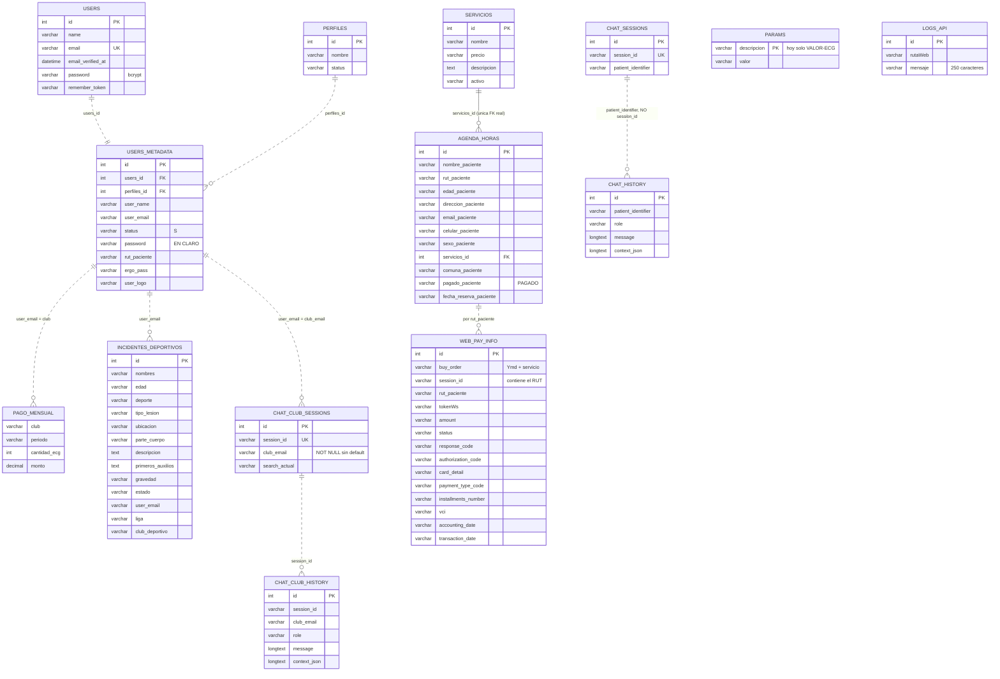
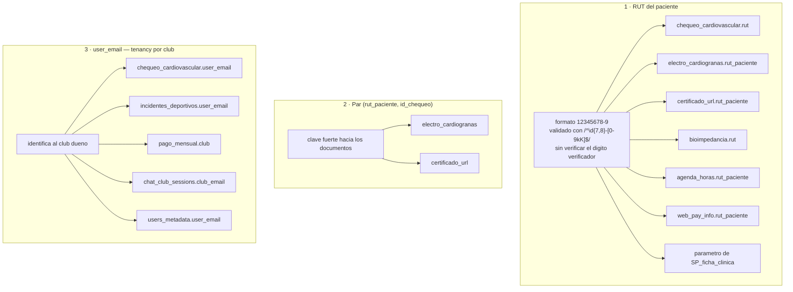
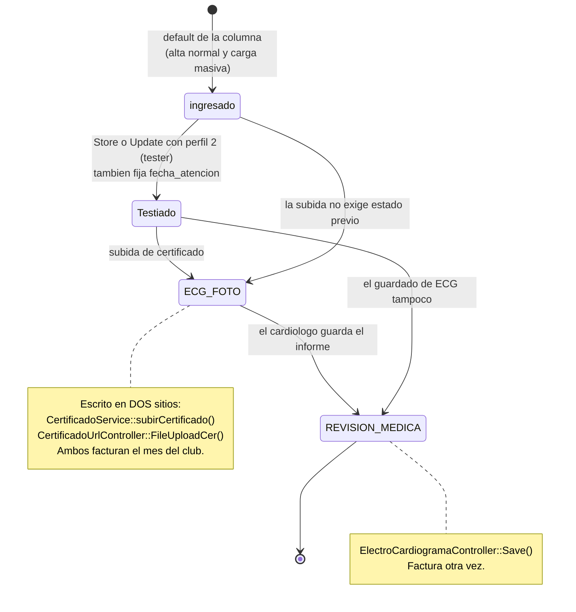
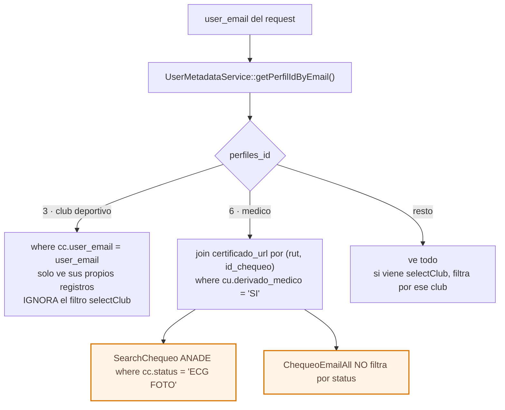
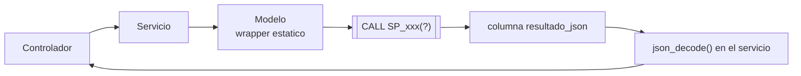

# Modelo de datos, estados y autorización

El esquema real de la base **va por delante de las migraciones del repo**. Las columnas de esta página se reconstruyeron contrastando tres fuentes, en este orden de fiabilidad: los schemas de [`openapi.yaml`](openapi.yaml), las migraciones de `database/migrations/`, y las queries del código para las columnas que solo existen en producción.

- [Diagrama entidad-relación: dominio clínico](#diagrama-entidad-relación-dominio-clínico)
- [Diagrama entidad-relación: negocio y conversaciones](#diagrama-entidad-relación-negocio-y-conversaciones)
- [Las tres claves de cruce](#las-tres-claves-de-cruce)
- [Máquina de estados del chequeo](#máquina-de-estados-del-chequeo)
- [Autorización por perfil](#autorización-por-perfil)
- [Procedimientos almacenados](#procedimientos-almacenados)

---

## Diagrama entidad-relación: dominio clínico

Las relaciones se dibujan **punteadas** porque en este esquema **casi ninguna tiene foreign key**: los cruces son por convención, no por integridad referencial declarada.

**Cuatro trampas de este esquema:**

- **`electro_cardiogranas` lleva una «n»**. Es un typo consolidado en producción; respétalo en las queries.
- **`imc` e `imc_paciente` coexisten.** El PDF y `ChequeoEmailAll` leen `imc_paciente`; `SP_chequeos_club_prompt` lee `cc.imc`.
- **`presionArterial` guarda la diastólica**, y la sistólica va en `presion_sistolica`. El SP del club las concatena al revés, y por eso `ClubAssistantService::normalizarPresion()` las invierte antes de mandarlas al modelo.
- Casi todo es `VARCHAR`: los números viajan como texto.

---

## Diagrama entidad-relación: negocio y conversaciones

**Perfiles conocidos:** 1 administrador · 2 tester · 3 club deportivo · 5 paciente · 6 médico.

**Tablas sin migración en el repo** — existen solo en la base de datos, igual que los procedimientos almacenados. `php artisan migrate` sobre una base vacía deja el esquema incompleto:

| Tabla | Por qué importa |
|---|---|
| `users_metadata` | Sin ella no hay perfiles, y todo el filtrado se cae |
| `params` | Sin la fila `VALOR-ECG`, los tres endpoints de facturación responden 500 |
| `electro_cardiogranas` | Sin ella no hay lectura de ECG ni estado derivado |
| `pago_mensual` | Sin ella no hay facturación mensual por club |

> `chat_history` **no guarda `session_id`**: el historial del asistente clínico se agrupa por `patient_identifier`, así que dos sesiones distintas que hablen del mismo paciente comparten la conversación. El chat de club sí agrupa por sesión.

---

## Las tres claves de cruce

Cambiar el RUT de un chequeo sin propagarlo deja los certificados y los ECG huérfanos. Por eso, al editar desde el perfil 1, `ChequeoCardiovascularController::Update()` dispara `CertificadoService::UpdateRutCertificado()` y `ElectroCardiogramaService::UpdateRutECG()`.

> Algunos joins antiguos (`filterCalendar`, `chequeoUserEmail`, `FindByEmail`, `LikeChequeoUser`) unen ECG y chequeo **solo por RUT**, no por el par completo. Eso duplica filas cuando un paciente tiene varios chequeos.

---

## Máquina de estados del chequeo

`chequeo_cardiovascular.status` es texto libre y avanza por cuatro valores.

### Quién escribe el `status`

Son **seis** puntos en el código PHP, no uno:

| Dónde | Valor | Condición |
|---|---|---|
| `ChequeoCardiovascularController::Store()` | `Testiado` | `perfilId == 2` |
| `ChequeoCardiovascularController::Update()` | `Testiado` | `perfilId == 2` |
| `ChequeoCardiovascularController::Update()` | **libre**, desde el request | `perfilId == 1` |
| `CertificadoService::subirCertificado()` | `ECG FOTO` | siempre |
| `CertificadoUrlController::FileUploadCer()` | `ECG FOTO` | siempre |
| `ElectroCardiogramaController::Save()` | `REVISION MEDICA` | siempre |

`ChequeoImport` no escribe `status`: queda el default de la base. El resto de transiciones puede venir de `UPDATE` del cliente o de procedimientos almacenados.

### El campo derivado `estado_paciente`

En los listados, el `status` se transforma antes de salir:

```mermaid
flowchart LR
    S["status del chequeo"] --> Q{"status = REVISION MEDICA?"}
    Q -->|no| T["se devuelve el status tal cual"]
    Q -->|si| E{"tiene ECG cargado?"}
    E -->|no| RC["En Rev. Cardio"]
    E -->|si| D["Diag. Card. - Normal<br/>o Diag. Card. - Alterado<br/>segun electro_cardiogranas.estado_paciente"]
```

Para el perfil 3 la búsqueda se ordena con `orderByRaw("FIELD(cc.status, 'ECG FOTO', 'REVISION MEDICA', 'Testiado', 'ingresado')")`.

Otros puntos que **leen** el status: `CertificadoUrlController::ValidaCertificado()` exige `REVISION MEDICA`, y `SP_chequeos_club_prompt` filtra `status = 'REVISION MEDICA'` — por eso el asistente por club solo ve pacientes en revisión médica.

---

## Autorización por perfil

El `perfilId` se obtiene con `UserMetadataService::getPerfilIdByEmail()` a partir del `user_email` **que llega en el request**. No es un control de acceso: es una regla de presentación.

El patrón está implementado en tres métodos de `ChequeoCardiovascularService`, y **las tres versiones no son idénticas**:

| Método | Perfil 3 | Perfil 6 | Join con ECG |
|---|---|---|---|
| `filterCalendar()` | sí | no lo aplica | por RUT |
| `SearchChequeo()` | sí, más `orderByRaw(FIELD(...))` | `derivado_medico='SI'` **y** `status='ECG FOTO'` | subquery del último ECG por `id_chequeo` |
| `ChequeoEmailAll()` | sí | `derivado_medico='SI'`, **sin** filtro de status | subquery `MAX(id) GROUP BY id_chequeo` |

Si cambias la regla, hay que revisar los tres —y decidir a propósito si la divergencia actual es intencional—.

**Otras dos anomalías de estas queries**, útiles si algo se comporta raro:

- `filterCalendar()`, `FindByEmail()` y `LikeChequeoUser()` ejecutan `->get()` **dos veces** sobre el mismo builder; el primer resultado se descarta.
- Varios `SELECT` mezclan `MAX(ec....)` con columnas no agregadas y **sin `GROUP BY`**. Funciona en la base actual, pero rompe si se activa `only_full_group_by`.
- `SearchChequeo()` sin filtros devuelve `'total' => 300` **hardcodeado**, no el total real.

---

## Procedimientos almacenados

Gran parte de las estadísticas vive en MySQL, no en PHP. Los modelos exponen wrappers estáticos sobre `DB::select('CALL SP_xxx(?)')`, y casi todos devuelven una única columna `resultado_json` que el servicio decodifica. La API invoca **19**.

| Procedimiento | Modelo | Servicio | Endpoint |
|---|---|---|---|
| `SP_estadistica_IMC` | `ChequeoCardiovascular` | `EstadisticasService::EstadisticaIMC` | `GET estadisticas/estadistica-imc/{email}` |
| `sp_estadistica_presion` | `ChequeoCardiovascular` | `EstadisticasService::EstadisticaPresion` | `GET estadisticas/estadistica-presion/{email}` |
| `SP_estadistica_hemoglucotest` | `ChequeoCardiovascular` | `EstadisticasService::SP_estadistica_hemoglucotest` | `GET estadisticas/estadistica-hemoglucotest/{email}` |
| `SP_estadistica_saturacion` | `ChequeoCardiovascular` | `EstadisticasService::SP_estadistica_saturacion` | `GET estadisticas/estadistica-saturacion/{email}` |
| `SP_estado_general` | `ChequeoCardiovascular` | — (llamada directa) | `GET chequeo-cardiovascular/estado-general/{email}` |
| `SP_estadistica_monto` | `ChequeoCardiovascular` | `EstadisticasService::EstadisticaPagoMensual` | `GET estadisticas/estadistica-pago-mensual` |
| `SP_pago_mensual` | `ChequeoCardiovascular` | `EstadisticasService::PagoMensual` | `POST estadisticas/pago-mensual` **y los 3 flujos que facturan** |
| `SP_agenda_mensual` | `PagoMensual` | `EstadisticasService::AgendaMensual` | `POST estadisticas/agenda-mensual` |
| `SP_estadistica_monto_mdc` | `PagoMensual` | `EstadisticasService::EstadisticaPagoMDC` | `GET estadisticas/estadistica-pago-mdc` |
| `SP_update_pago_mensual` | `PagoMensual` | `EstadisticasService::UpdatePagoMensual` | `POST estadisticas/update-pago-mensual` |
| `SP_chequeos_prompt` | `PagoMensual` | `EstadisticasService::ChequeoPrompt` | `POST sam-assistant/as-question` |
| `SP_chequeos_club_prompt` | `ChequeoClubPrompt` | `ClubAssistantService::datosClub` | `POST sam-assistant-club/as-question` |
| `SP_ficha_clinica` | `FichaClinica` | `FichaClinicaService::FichaClinica` | `GET ficha-clinica/{rut}` |
| `SP_bioimpedacia_rut` | `Bioimpedancia` | `BioimpedanciaService::BioPDFRut` | `GET bioimpedancia/pdfRut/{rut}` |
| `SP_estadistica_liga` | `IncidentesDeportivos` | `IncidentesService::sp_estadistica_liga` | `GET incidencia-deportivos/sp_estadistica_liga/{email}` |
| `SP_estadistica_categoria` | `IncidentesDeportivos` | `IncidentesService::sp_estadistica_categoria` | `GET incidencia-deportivos/sp_estadistica_categoria/{email}` |
| `SP_estadistica_lesiones` | `IncidentesDeportivos` | `IncidentesService::sp_estadistica_lesiones` | `GET incidencia-deportivos/sp_estadistica_lesiones/{email}` |
| `SP_estadistica_parte_cuerpo` | `IncidentesDeportivos` | `IncidentesService::sp_estadistica_parte_cuerpo` | `GET incidencia-deportivos/sp_estadistica_parte_cuerpo/{email}` |
| `SP_estadistica_lesiones_fechas` | `IncidentesDeportivos` | `IncidentesService::sp_estadistica_lesiones_fechas` | `GET incidencia-deportivos/sp_estadistica_lesiones_fechas/{email}` |

**Solo `SP_chequeos_club_prompt` está versionado** en el repo (`base_datos/references/sp/SP_chequeos_club_prompt.sql`). El resto son cajas negras que viven únicamente en la base: al cambiar su firma hay que actualizarlos ahí directamente, y no queda rastro en git.

La base declara **23 procedimientos**, pero la API solo invoca los 19 de la tabla. Los otros cuatro (`SP_cargar_desde_chequeo`, `SP_filtros_dashboard`, `SP_procesar_mes` y `tmp_call_sp`) no los llama ningún endpoint: antes de borrar alguno, comprueba que no lo use un proceso externo.

---

**Ver también:** [Arquitectura](arquitectura.md) · [Flujos end-to-end](flujos.md) · [Diagrama de clases](diagrama-clases.md)
